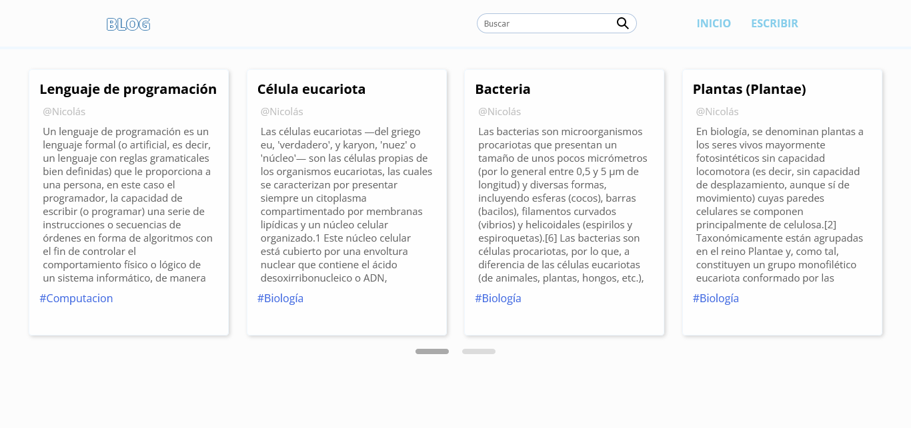
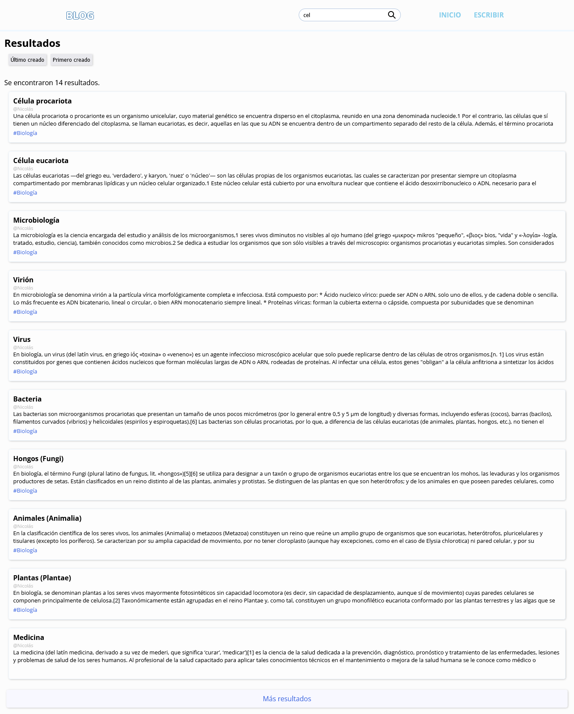
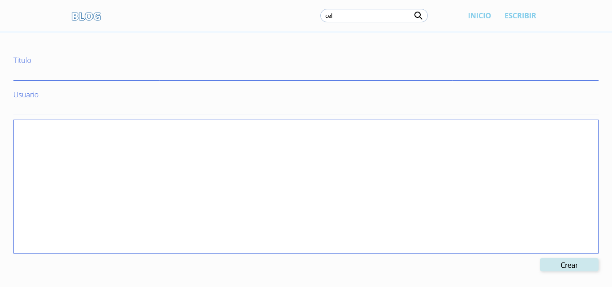

# Blog 1 (React - Json-Server)

Un blog, estilo wikipedia, usando una fake-api en json-server.

*Version 1.0*

- Los Hashtag no funcionan para linkear.
- Hay datos cargados de ejemplo. 

### Install
    npm install
    npm install -g json-server

### Ejecutar
###### Json-Server (port: 8000):
    json-server --watch datos/db.json --port 8000

###### React:
    npm start

## Inicio

Muestra 10 artículos al azar de la fake api.

## Artículo

Visualización de artículo.

## Busqueda

Busqueda convencional en la fake api, y carga hasta 10 artículos por vez.

## Crear Artículo

Caulquiera puede crear, y se puede agregar nombre del creador

